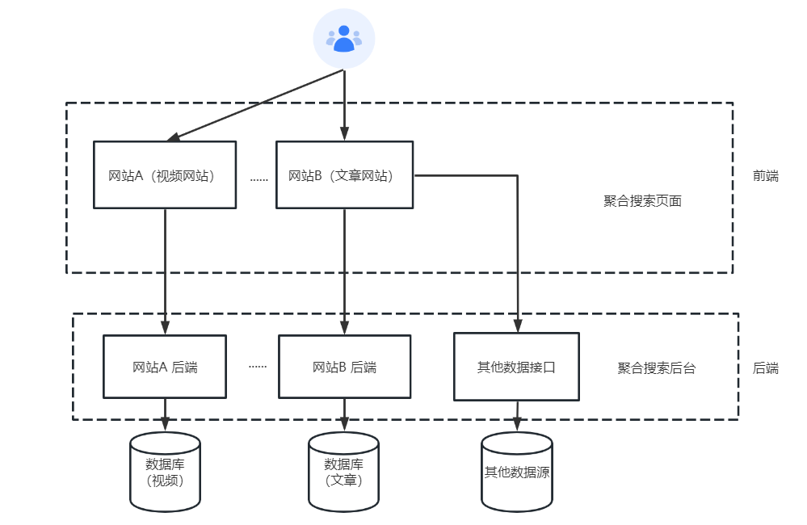

# 聚合搜索平台后端

> 作者：[nland](https://github.com/wfdgdfw)

基于 Java SpringBoot 的项目初始模板开发。使用 Spring Boot + ElasticSearch的一站式聚合搜索平台。


### 系统架构图



### 后端

* Spring Boot 2.7 框架 +  [springboot-init](https://github.com/wfdgdfw/springboot-init.git)脚手架
* MySQL 数据库（8.x 版本）
* Elasticsearch 搜索引擎
* 设计模式
  * 策略模式
  * 适配器模式
  * 注册器模式
* 定时数据同步（@Scheduled注解）
* JMeter 压力测试

- MySQL 数据库

  


## 业务功能

- 提供示例 SQL（用户、帖子、帖子点赞、帖子收藏表）

- 用户登录、注册、注销、更新、检索、权限管理

- 帖子创建、删除、编辑、更新、数据库检索、ES 灵活检索

- 帖子点赞、取消点赞

- 帖子收藏、取消收藏、检索已收藏帖子

- 帖子全量同步 ES、增量同步 ES 定时任务

- 搜索图片（没数据，实时获取图片链接）

  


## 快速上手

### MySQL 数据库

1）修改 `application.yml` 的数据库配置为你自己的：

```yml
spring:
  datasource:
    driver-class-name: com.mysql.cj.jdbc.Driver
    url: jdbc:mysql://localhost:3306/my_db
    username: root
    password: 123456
```

2）执行 `sql/create_table.sql` 中的数据库语句，自动创建库表

3）启动项目，访问 `http://localhost:8102/api/doc.html` 即可打开接口文档，不需要写前端就能在线调试接口了


### Redis 分布式登录

1）修改 `application.yml` 的 Redis 配置为你自己的：

```yml
spring:
  redis:
    database: 1
    host: localhost
    port: 6379
    timeout: 5000
    password: 123456
```

2）修改 `application.yml` 中的 session 存储方式：

```yml
spring:
  session:
    store-type: redis
```

3）移除 `MainApplication` 类开头 `@SpringBootApplication` 注解内的 exclude 参数：

修改前：

```java
@SpringBootApplication(exclude = {RedisAutoConfiguration.class})
```

修改后：


```java
@SpringBootApplication
```

### Elasticsearch 搜索引擎

1）修改 `application.yml` 的 Elasticsearch 配置：

```yml
spring:
  elasticsearch:
    uris: http://localhost:9200
    username: root
    password: 123456
```

2）复制 `sql/post_es_mapping.json` 文件中的内容，通过调用 Elasticsearch 的接口或者 Kibana Dev Tools 来创建索引

```
PUT post_v1
{
 参数见 sql/post_es_mapping.json 文件
}
```


3）开启同步任务，将数据库的帖子同步到 Elasticsearch

找到 job 目录下的 `FullSyncPostToEs` 和 `IncSyncPostToEs` 文件，取消掉 `@Component` 注解的注释，再次执行程序即可触发同步。
